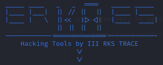

# RKS Tools



RKS Tools is a versatile collection of hacking tools designed for various security testing scenarios. Whether you're conducting SQL injection scans, performing XSS analysis, or exploring network vulnerabilities, RKS Tools has got you covered.

## Table of Contents

1. [SQLi Scanner](#sqli-scanner)
2. [Trace-XSS](#trace-xss)
3. [Trojans](#trojans)
4. [DNS-Enum](#dns-enum)
5. [CryptoSpyder](#cryptospyder)
6. [PortScanner](#portscanner)
7. [Crawler](#crawler)

## Installation
```bash
git clone https://github.com/ikazzzzz/erkaes
cd erkaes
pip install -r requirements.txt
```

## *Notes
Make sure you have the necessary permissions before using this tool in any environment (**sudo**).

## Module Usage

### SQLi Scanner

#### Usage Examples

- Scan a specific URL for SQL injection vulnerabilities:

```bash
python3 rks.py -m 1 -u http://example.com/login.php
```


### Trace-XSS

#### Usage Examples

- Discover XSS vulnerabilities using various methods:

```bash
python3 rks.py -m 2 -d example.com -o xssout.txt
python3 rks.py -m 2 -f /output/crawl/example.com.txt
python3 rks.py -m 2 -u http://example.com/listproducts.php?cat=FUZZ
```

### Trojans

#### Usage Examples

- Execute trojan functions, such as scraping emails, sending emails, or setting up a listening server:

```bash
python3 rks.py -m 3 -trojans scraper_email -u https://example.com -l 3
python3 rks.py -m 3 -trojans send_email -s sender@example.com -r recipient@example.com -su "Subject" -html index.html -msg "Hello"
python3 rks.py -m 3 -trojans listening -ip 192.168.1.1 -p 9888
```

### DNS Enum

#### Usage Examples

- Enumerate DNS information for a domain:

```bash
python3 rks.py -m 4 -d example.com -o dnsout.txt
```

### CryptoSpyder

#### Usage Examples

- Collect packet information from a network interface:

```bash
python3 rks.py -m 5 -i eth0
```

### PortScanner

#### Usage Examples

- Scan specific ports for a domain or IP address:

```bash
python3 rks.py -m 6 -d example.com -p 80
python3 rks.py -m 6 -ip 45.121.219.136 -p 75-85
python3 rks.py -m 6 -d example.com -p all
```

### Crawler

#### Usage Examples

- Crawl a website domain for URLs:

```bash
python3 rks.py -m 7 -d example.com
```


